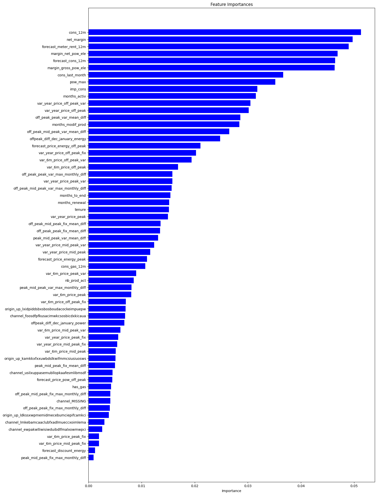

# Customer-Churn-Classification-Using-Random-Forest-Classifier

## Introduction
In today's highly competitive energy market, many customers switch to other providers offering lower prices or better deals. PowerCo, a gas and electricity supplier, is facing a big challenge in keeping its customers. One of the main reasons why customers might leave is price sensitivity—how much a change in price affects their decision to stay or leave.

This project, "Customer Churn Classification Using Random Forest Classifier," aims to understand why customers stop using PowerCo’s services. Using machine learning techniques, particularly the Random Forest Classifier, this project will classify customers into churn and non-churn categories. Additionally, it will investigate whether price sensitivity is indeed the most significant factor in customer churn or if other factors have a bigger impact.

Through exploratory data analysis (EDA), feature engineering, and predictive modeling, this project will provide insights to help PowerCo develop more effective retention strategies, minimize customer loss, and enhance long-term customer satisfaction.

## Goals
1. Analyze customer data to determine the main reasons why customers leave PowerCo, with a focus on price sensitivity.

2. Investigate whether price sensitivity is the most influential factor in customer churn or if other factors play a bigger role.

3. Offer recommendations to PowerCo on how to reduce customer churn and improve retention strategies.

## Dataset
This project uses a dataset from PowerCo, a company that provides gas and electricity. The dataset includes client data and price data, covering customer details such as contracts, billing history, and energy pricing.

1. Client Data: Contains information about PowerCo's customers, including contract details, billing history, and energy usage.

2. Price Data: Includes historical pricing information for PowerCo’s energy services.

## Exploratory Data Analysis
In this project, I conducted an exploratory data analysis (EDA) on client data and price data provided by PowerCo to understand customer churn patterns. Here are the key findings from the analysis:

### 1. Churn Rate Analysis
- The churn rate among PowerCo’s customers is approximately 10%, which is relatively low.

- A lower churn rate is beneficial for the company, but identifying the main factors influencing churn is crucial to further reducing it.

### 2. Churn Analysis by Different Factors
- Sales Channel: Some sales channels have a higher churn rate, while others have no churn at all. This suggests that certain sales strategies may influence customer retention.

- Contract Type: The churn rate is evenly distributed across different contract types, indicating that contract type may not be a key driver of churn.

- Number of Products & Subscription Duration: Examining the number of products and years of subscription helps in understanding customer loyalty and its impact on churn.

### 3. Data Distribution and Outliers
- Consumption Data: The distribution of energy consumption is positively skewed, meaning most customers consume lower amounts of energy.

- Outliers Detection: A boxplot analysis revealed several outliers in the consumption data, which might need further processing in the feature engineering phase.

- Pricing Data: Understanding price sensitivity is key, as price changes could be a major factor influencing churn.

## Feature Engineering
In this project, feature engineering was conducted to enhance the dataset and improve the accuracy of the customer churn prediction model. The following key steps were taken:

### 1. Creating New Features
- Average Price Change Across Periods: Measures the average price change between peak, mid-peak, and off-peak periods for each company

- Maximum Price Difference Across Periods and Months: Instead of average price change, this feature captures the maximum price difference, providing insight into price fluctuations.

- These features help understand price sensitivity, which may influence customer churn.

### 2. Data Transformation
- Date Transformation: The date column was converted into months, and the original date column was removed.

- Boolean Conversion: Boolean values were converted into binary (1 for Yes, 0 for No).

- Categorical Encoding: Categorical columns were transformed into dummy variables to make them suitable for machine learning models.

### 3. Handling Skewed Distributions
- Some columns had a skewed distribution, which could affect model performance.

- Log transformation was applied to make the distribution closer to normal, ensuring better feature representation.

### 4. Correlation Analysis
- A correlation matrix was plotted to identify highly correlated features.

- Features with very high correlation were considered for removal to prevent redundancy.

## Modelling and Evaluation
In this project, I built a churn prediction model using a Random Forest Classifier. The model was developed using a cleaned and feature-engineered dataset of customers and pricing data.

### 1. Model Building
- The data was split into training and testing sets to measure model performance on unseen data.
  
- The model was trained using a Random Forest Classifier, with parameters optimized for better prediction accuracy.

### 2. Model Evaluation
We use 3 metrics, accuracy, precision and recall.
The reason why we are using these three metrics is because a simple accuracy measure (what percentage did I predict correctly) is not always a good measure to use.
- Accuracy – Measures the percentage of correct predictions.

- Precision – Indicates how accurate the model is in identifying churned customers.

- Recall – Measures how well the model captures all actual churned customers.

Key Findings:

- The model accurately predicts non-churn customers.

- However, it struggles to correctly identify churned customers, suggesting that the current features may not fully capture churn behavior.

- Feature importance analysis showed that net margin and 12-month energy consumption were the most important factors, while price sensitivity features were not significant.

## Summary
1. 10% of customers in the dataset churned.

2. The predictive model successfully identifies churn, but customer price sensitivity is not the main driver.

3. Yearly consumption and net margin are the most significant factors influencing churn.

4. Forecasted consumption also plays a key role in churn prediction.

## Retention Strategy
1. Offer a 20% discount for high-value customers identified as having a high churn probability.

2. Implement a loyalty rewards program, where long-term customers receive lower rates or cashback incentives.
